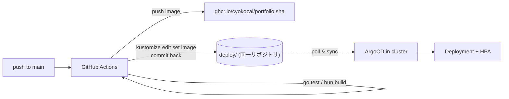

# ADR-002: GitHub Actions でビルドし ArgoCD が pull 型で同期する

- ステータス: Accepted
- 日付: 2026-08-19
- 関連: [ADR-001](./ADR-001-delivery-architecture.md), [前提](../assumptions-20260819.md)

## コンテキスト

デプロイ先はオンプレ VM 上の k3s / k3d で、外部からの inbound は Cloudflare Tunnel 経由に限定している。手動 `kubectl apply` は運用手段に含めない。

## 決定

1. GitHub Actions がテスト・ビルド・イメージ push（GHCR）を行う
2. 同じワークフローが `kustomize edit set image` でタグを差し替え、リポジトリへコミットを戻す
3. クラスタ内の ArgoCD がそのコミットを検知して同期する（pull 型）
4. マニフェストはアプリと同一リポジトリの `deploy/` に置く

## 理由

- **pull 型なので VM に外部からの入り口を開けなくてよい** — Cloudflare Tunnel で inbound を塞いでいる構成と噛み合う
- **ArgoCD Image Updater を入れない** — 運用コンポーネントが 1 つ減る。Image Updater を使っても結局リポジトリへ書き戻すため、得られるものが少ない
- **コミット履歴がそのままデプロイ監査ログになる** — ポートフォリオとして説明しやすい
- **単一リポジトリ** — 1 人開発でリポジトリを分ける利点が無い

## Kustomize を overlay 無しで使う理由

環境は本番 1 つだけであり、overlay の分岐先が存在しない（k3d は k3s を Docker で動かすものなので、マニフェストは一字も変わらない）。それでも Kustomize を残すのは、**`kustomize edit set image` によるタグ差し替えを機械的に行うため**である。

## 結果と対策が必要な点

- **bot コミットによる CI の自走** — ビルドワークフローに `paths-ignore: deploy/**` を設定する。これを忘れると無限ループする
- **GHCR を private にすると imagePullSecret が必要** — ポートフォリオなのでイメージは public を前提とする
- ArgoCD 自体の導入は GitOps の対象外（bootstrap は初回のみ手動）
- Cloudflare Tunnel の認証情報は Secret として扱う。リポジトリには絶対に置かず、クラスタへ直接登録する
