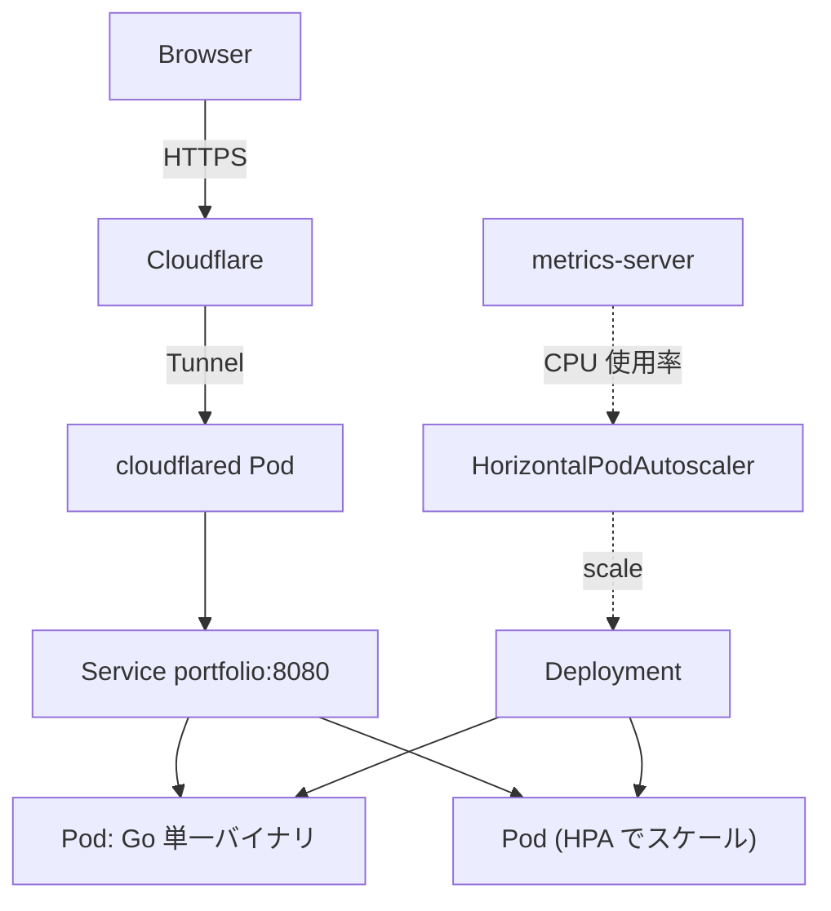
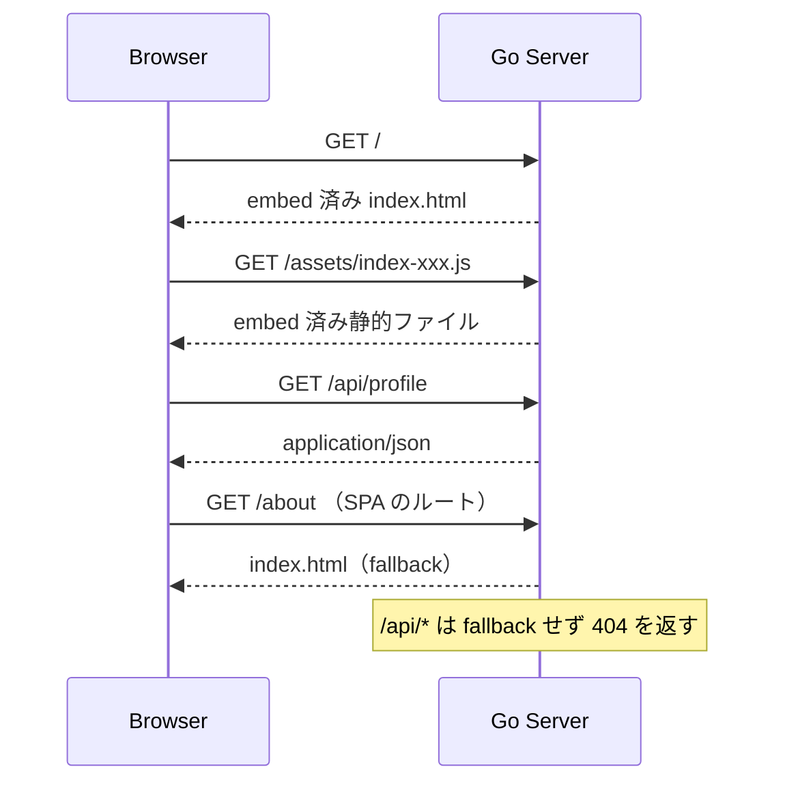
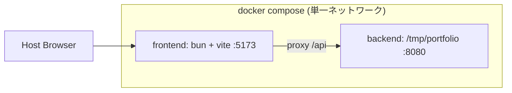

# アーキテクチャ決定サマリ

前提: [assumptions-20260819.md](./assumptions-20260819.md)
個別の決定記録: [ADR-001](./adr/ADR-001-delivery-architecture.md) / [ADR-002](./adr/ADR-002-gitops-delivery.md)

## 結論

**本番は Go 単一バイナリ（SPA を `go:embed`）、開発は compose による 2 コンテナ。** 本番と開発で意図的に形を変える。

- 本番: 1 イメージ / 1 Deployment。フロントとバックの版ずれが原理的に起きず、HPA のスケール対象も 1 つで済む
- 開発: Vite の HMR を殺さないため、frontend / backend を別コンテナのまま同一ネットワークに置き、`/api` を proxy する

## システム全体構成



Pod 内の 1 プロセスが、埋め込んだ SPA と `/api` の両方を同一オリジンで返す。CORS は本番では発生しない。

## リクエストの振り分け



| パス | 用途 | 挙動 |
|---|---|---|
| `/health` | liveness probe | 起動後は常に 200 |
| `/ready` | readiness probe | SIGTERM 受信後は 503 に反転 |
| `/api/*` | コンテンツ API | JSON。未定義パスは 404（fallback しない） |
| `/*` | SPA | 実ファイルがあれば返し、無ければ `index.html` |

`/health` と `/ready` を分けるのは HPA のスケールインとローリング更新への対応。SIGTERM を受けたら readiness を先に落として Service のエンドポイントから外れ、その後に `http.Server.Shutdown()` を呼ぶ。この順序を守らないと、Service がまだ Pod を宛先に含んでいる間に接続が切れて 502 になる。

## 開発時の構成



現状 `frontend/container/compose.yaml` と `backend/container/compose.yaml` は project 名が別（`portfolio-frontend` / `portfolio-backend`）でネットワークが分離しており、**フロントから API を叩き始めた時点で通信できない**。ルートに `compose.yaml` を 1 本置いて統合する。

### 開発時にサーバを起動する方法

**`go run` を使わない。** `go run` は自分が起動した子プロセスに SIGTERM を転送しないため、graceful shutdown が一度も実行されない。実測（2026-08-22）:

```
  PID  PPID  COMM
   89    84  go        ← SIGTERM を受けて Terminated
  133    89  server    ← 生き残って孤児化。正常停止のログは出ない
```

停止順序の検証は本番と同じく「ビルド済みバイナリを直接起動する」形で行う。

```bash
docker compose exec -d backend sh -c 'go build -o /tmp/portfolio ./cmd/server && /tmp/portfolio'
```

また compose の各サービスに `working_dir` を指定してある。`devcontainer.json` の `workspaceFolder` は VS Code でアタッチしたときにしか効かず、`docker compose exec` は `/workspace` に降りてしまうため。

## 検討したが採らなかった案

| 案 | 不採用の理由 |
|---|---|
| nginx + Go の 2 コンテナ | Deployment が 2 つになり HPA も二重管理。成熟した静的配信の利点は日 PV 数百では回収できない |
| 静的を Cloudflare Pages に分離 | デプロイ経路が 2 系統に分かれる。前提 3（オンプレ k8s 運用が主題）を薄める |
| Kustomize の base + overlays | 環境が本番 1 つだけのため overlay の分岐先が無い。Kustomize 自体はイメージタグ差し替えのために残す |

## 既知のトレードオフ

- 静的ファイルだけの修正でも Go バイナリの再ビルドが必要。この規模では許容する
- 静的配信と API が同一プロセスのため個別にスケールできない。静的トラフィックが支配的になった時点で再検討する
- gzip / brotli と `Cache-Control` は自前実装。Go 標準の `http.FileServer` は ETag と Range には対応済み
- HPA はこの規模では実発火しない見込み。機構として成立させることが目的なので、`resources.requests` は過大に置かず `cpu: 50m` 程度の現実的な値にする
